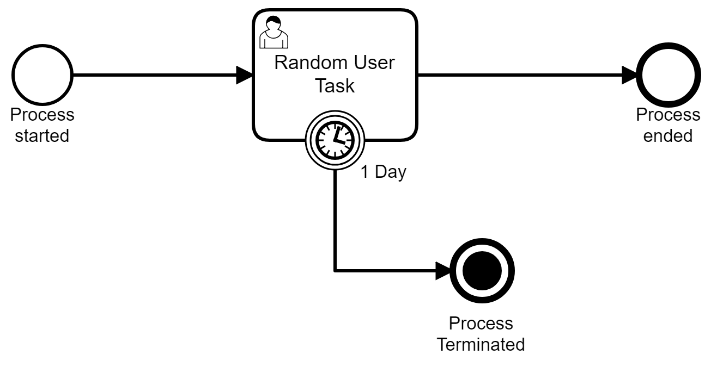

# Camunda Delegation Test
## Finding active timer Job instance associated with a user task in a given process instance

In the given  simple process  there is a timer which monitors the user task with a deadline.

The attempt is to acquire the timer Job instance programmatically so that it can be suspended/resumed at will.

In order to achieve that, a combined JavaDelegate and TaskListner class has been added to User Task "Random User Task". **Unfortunately** though, it cannot find any job instances. The delegate class has been attached to *start* execusion listner for the user task as well as to *create* and *assignment* events as task listner.

The example log extracts are:
```
INFORMATION:

LoggerDelegate::execute invoked by processDefinitionId=JobFinder:1:3, activtyId=randomUserTask, activtyName='Random User Task', processInstanceId=5, businessKey=null, executionId=7
Jan. 24, 2020 3:14:50 NACHM. test.camunda.delegation.LoggerDelegate execute
INFORMATION: How many jobs are there for current process instance? 0
Jan. 24, 2020 3:14:50 NACHM. test.camunda.delegation.LoggerDelegate execute
INFORMATION: How many jobs are there in total? 0
Jan. 24, 2020 3:14:50 NACHM. test.camunda.delegation.LoggerDelegate notify
INFORMATION:

LoggerDelegate::notify invoked by processDefinitionId=JobFinder:1:3, activtyId=randomUserTask, activtyName='Random User Task', processInstanceId=5, businessKey=null, executionId=7
Jan. 24, 2020 3:14:50 NACHM. test.camunda.delegation.LoggerDelegate notify
INFORMATION: Current Event: create
Jan. 24, 2020 3:14:50 NACHM. test.camunda.delegation.LoggerDelegate notify
INFORMATION: How many jobs are there for current process instance? 0
Jan. 24, 2020 3:14:50 NACHM. test.camunda.delegation.LoggerDelegate notify
INFORMATION: How many jobs are there in total? 0
Jan. 24, 2020 3:14:50 NACHM. test.camunda.delegation.LoggerDelegate notify
INFORMATION:

LoggerDelegate::notify invoked by processDefinitionId=JobFinder:1:3, activtyId=randomUserTask, activtyName='Random User Task', processInstanceId=5, businessKey=null, executionId=7
Jan. 24, 2020 3:14:50 NACHM. test.camunda.delegation.LoggerDelegate notify
INFORMATION: Current Event: assignment
Jan. 24, 2020 3:14:50 NACHM. test.camunda.delegation.LoggerDelegate notify
INFORMATION: How many jobs are there for current process instance? 0
Jan. 24, 2020 3:14:50 NACHM. test.camunda.delegation.LoggerDelegate notify
INFORMATION: How many jobs are there in total? 0
```

On the other hand, the process can be driven through a test JUnit test driver application. There using the management service instance acquired through process engine object can indeed display the job.

```
===========================================================
Job Count: 1

Job Details: TimerEntity[repeat=null, id=9, revision=1, duedate=Sat Jan 25 15:14:50 CET 2020, repeatOffset=0, lockOwner=null, lockExpirationTime=null, executionId=7, processInstanceId=5, isExclusive=true, retries=3, jobHandlerType=timer-transition, jobHandlerConfiguration=timerTaskTerminator, exceptionByteArray=null, exceptionByteArrayId=null, exceptionMessage=null, deploymentId=1]
===========================================================
```

I'm trying to solve this mystery.